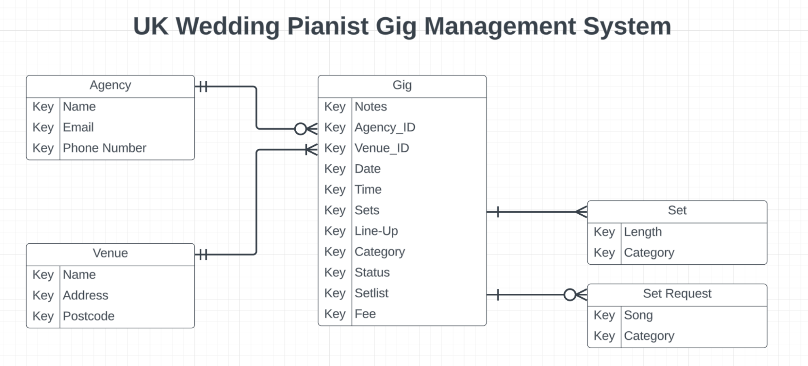
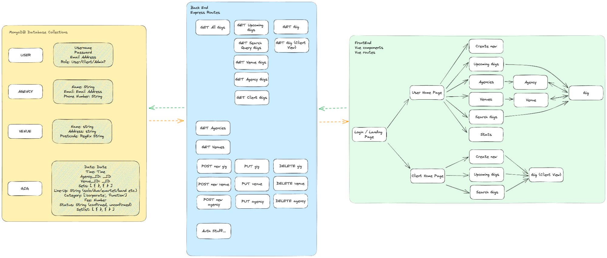

# Project 2: Gig Manager ReadMe

## Description

The idea for Gig Manager came from talking to a friend who is a musician, who has to manage his bookings across many different clients, venues and agencies - currently using a basic spreadsheet.

Gig Manager enables musicians to create gigs, associate them with venues and agencies and displays them in a useful format. Musicians can track gigs from a specific agency, and compare which agencies have earned them the greatest fees over time, have access to Google Maps of the venues at which they will perform, and even enables them to keep track of specific song requests for their setlists for each gig.

This was my first full-stack application, built using a MEVN stack for the General Assembly Software Engineering Immersive bootcamp

## Deployment link

[https://gig-manager.netlify.app/](https://gig-manager.netlify.app/)

## Getting Started/Code Installation

[https://github.com/stars/thstanton/lists/gig-manager](https://github.com/stars/thstanton/lists/gig-manager)

## Timeframe & Working Team

This project was completed solo, in 1 week.

## Technologies Used

* Vue.js
* MongoDB
* Mongoose
* Express.js
* Node.js
* Vuetify component library
* Google People API
* Google Maps JavaScript API
* Google Geolocation API
* ChartJS

## Brief

This second project will be your first adventure into building a full-stack application. You'll be building a Node/Express/MongoDB app from the ground up yourself.

This is exciting and by the end of this unit we will have given you all of the tools needed to build your app.

You get to decide what you want to build - as long as it meets the technical requirements outlined below.

You will be working individually for this project. You'll be designing and coding the app yourself. 

### Technical Requirements:
* Have at least 2 data entities (data resources) in addition to the `User` Model - one entity that represents the main functional idea for your app and another with a One:Many or Many:Many relationship with that main entity (embedded or referenced).
* Use OAuth authentication.
* Implement basic authorization that restricts access to features that need a logged in user in order to work (typically CUD data operations) by "protecting" those routes from anonymous users.
* Have full-CRUD data operations somewhere within the app's features.
* Be styled such that the app looks and feels similar to apps we use on a daily basis - in other words, it should have a consistent and polished user interface.
* Be deployed online.

**Optionally, your App may:**
* Consume a third-party API. 
* Expose its own API where it returns data resources as JSON.

## Planning

Following conversations with my friend about his use case, I began by creating an ERD, to ensure I understood the data structure required for this project.



I then began to think about expressing the use case in terms of user stories, and put them into categories according to whether they were part of the minimum viable product, or whether they were ‘nice to have’. I kept track of these on this [Trello board](https://trello.com/invite/b/7MscLHu9/ATTIdee00b1cc17f80c38979cb83b3f54870DE96BE79/crud-app-project).

Finally, I created this diagram to ensure I had a clear idea of what was needed in the database, the back end and the front end going into the build.



## Build/Code Process

**Setting up the back end**

I began by setting up the back end. Although I had previously used an index.js file and kept all endpoints, controllers and schemas in the same file, I knew that for this project this was going to become unwieldy so I created separate files with controllers for each model.


```js
// ! Import node modules
const cors = require('cors')
const bodyParser = require('body-parser')
require('./config/database')

// ! Initialise express
const express = require('express')
const api = express()
const app = express.Router()
api.use(bodyParser.json())
api.use(cors())
api.listen(4000)

// ! Import Controllers
import { gigs } from "../../controllers/gigsCtrl"
import { venues } from "../../controllers/venuesCtrl"
import { agencies } from "../../controllers/agenciesCtrl"
import { users } from "../../controllers/usersCtrl"

// ! Endpoints
// ? Gigs
app.get('/gigs', gigs.getAll)
app.get('/gigs/upcoming', gigs.upcoming)
app.get('/gigs/populate-form', gigs.populateForm)
app.get('/gigs/populate-form/:id', gigs.populateForm)
app.get('/gigs/status/:status', gigs.status)
app.get('/gigs/agency/:agencyId', gigs.agency)
app.get('/gigs/stats/agencies', gigs.agencystats)
app.get('/gigs/stats/agencies/:agencyId', gigs.agencystats)
app.get('/gigs/venue/:venueId', gigs.venue)
app.get('/gigs/:id', gigs.getOne)
app.post('/gigs/new', gigs.new)
app.put('/gigs/update/:id', gigs.update)
app.delete('/gigs/delete/:id', gigs.delete)
```

This approach helped me to keep my code tidy, as well as easily refer to the endpoints I needed when working with the front end.

**Setting up the front end**

Vue.js was the first front end library I used, so there was a fairly steep learning curve for this! I began by creating the single gig page, as gigs were the core model and being able to see all of the information for a gig, clearly laid out on a single page was one of the most important functions of the app.

The gig model is quite complex, with many fields, related models and subdocument arrays for the setlists and sets.

```js
const gigSchema = new Schema({
   gigType: String,
   date: Date,
   startTime: String,
   endTime: String,
   agencyName: String,
   agencyId: Schema.Types.ObjectId,
   venueName: String,
   venueId: Schema.Types.ObjectId,
   lineUp: String,
   gigSets: [{
       length: Number,
       desc: String
   }],
   notes: String,
   fee: Number,
   genres: [],
   requests: [{
       name: String,
       desc: String
   }],
   status: String
}, {
   timestamps: true
})
```
I wanted to display these in a grid format, with cards to separate out the content. So I decided to try out Vuetify as a component library to help me to achieve this. Working out how to use Vuetify was a complete paradigm shift for me, I had briefly used Bootstrap before - but only using the CDN to assign classes, rather than pre-made components, so I needed to make extensive use of the Vuetify docs to help me to create the grid that I wanted. A particular challenge was making sense of Vuetify’s implementation of a grid layout. I initially created this page using static data, with the idea that I would add in the link to the backend API once the page was set up as I wanted.

Once the single gig view was set up, I then moved onto creating the form for users to create a new gig. One of the most challenging parts of this was working out how to manage the parts of the model which were made up of subdocuments, such as the sets.

My solution was for the user to create a new set, with a separate newSet property in the v-model:

```js
newSet: {
           length: '',
           desc: ''
       },
```


Then, once the details were added, a createSet function would push this object into the gigSets array in the gig model.

```js
       createSet: function () {
           this.gig.gigSets.push(this.newSet)
           this.newSet = {
               length: '',
               desc: ''
           }
           this.menus.set = false
       },
```

I also needed the user to be able to modify the sets if they made a mistake, so underneath the create set form components, I used the v-for directive to list the sets in the array, each with a delete button, which splices them from the array.

```js
<!-- ? Display created sets -->
<v-list v-for="(set, i) in gig.gigSets" v-bind:key="i">
   <v-card>
      <v-card-title>{{ set.length }} minutes</v-card-title>
      <v-card-subtitle>{{ set.desc }}</v-card-subtitle>
      <v-card-actions>
         <v-btn @click="gig.gigSets.splice(i, 1)">Remove</v-btn>
      </v-card-actions>
   </v-card>
</v-list>
```


Once the form was completed, I hooked this up to the POST endpoint in the back end and ensured it was working so that gigs could be created and changed the single gig view to fetch a gig and render it dynamically.

At this point I ran into a fairly major issue with displaying dates - detailed in the challenges section below.

**Refactoring to make better use of components and props**

I then moved onto displaying all of the gigs in a card format for the all gigs view, as well as the gigs filtered by agency and venue using simple filtering functions in the back end.

```js
// Get gigs filtered by agency
async function filterAgency(req, res) {
   try {
       const agency = req.params.agencyId
       const gigs = await Gig
           .find( { agencyId: agency } )
           .sort('-date')
           .lean()
       return res.status(200).json(gigs)
   } catch (err) {
       console.error(err)
       return res.status(400).json({ error: 'Something went wrong' })
   }
}
```

While I was completing these processes, I realised that I was repeating quite a lot of code - as the cards and the grids to display the cards were the same on each of these pages. So far, I had only used components as the pages, rather than separate parts of the page. To try to make the process of creating these pages more efficient, I decided that I would try to create the grid as a reusable component, passing in props to tell it which gigs to display. My initial version of the GigGrid component performed the fetch within the component, using conditionals to determine which data to fetch based on the props passed in:

```js
name: 'GigGrid',
   props: ['agencyId', 'venueId', 'status'],
   data: () => ({
       gigs: [],
       dataLoaded: false,
       icons: {
           wedding: "mdi-ring",
           residency: "mdi-city",
           function: "mdi-office-building"
       }
   }),
   async mounted() {
       try {
           let response = null
           if (this.agencyId) {
               response = await fetch(`${API_GIG_URL}/agency/${this.agencyId}`)
           } else if (this.venueId) {
               response = await fetch(`${API_GIG_URL}/venue/${this.venueId}`)
           } else if (this.status) {
               response = await fetch(`${API_GIG_URL}/status/${this.status}`)
           }
           if (!response.ok) {
               throw new Error(`HTTP error! Status: ${response.status}`);
           }
           if (response) {
               let data = await response.json()
               this.gigs = data
               this.dataLoaded = true
           }
       } catch (err) {
           console.error('Error:', err)
       }
```

I thought better of this and altered it later…

Having ‘unlocked’ the idea of reusable components, I became slightly obsessed with the idea and tried to make my components as reusable as possible. One of the solutions I am particularly pleased with was the edit menus - see the wins section for more detail.

**Combining fetches, more refactoring!**

One of the more challenging aspects of using Vue was handling the data fetches on mount, which threw errors whenever Vue tried to render elements for which the data had not yet loaded. I have detailed some of the solutions I used for these issues in the challenges section.

I still had issues with some of my pages, however. On the single agency and single venue page, for example:

```js
       async mounted() {
           const response = await fetch(`${API_AGENCIES_URL}/${this.$route.params.id}`)
           let data = await response.json()
           this.agency = data
           this.dataLoaded = true
       }
   }

<GigGrid v-if="dataLoaded === true" :agencyId="agency._id" />
```

Here, the page was fetching the agency data, then passing the agencyId into the GigGrid - which in turn was fetching the filtered gig data. Without the dataLoaded flag, the data was not being fetched quickly enough to display the gig data without errors. With the flag, the gig data was only loading _after_ the agency data had already been fetched - which was slow.

I decided that from this point on, only page-level components would fetch data to alleviate this ‘waterfall’ effect. I refactored my back end endpoints, to ensure that only one fetch would be needed to get all the data for that page. For example, the single agency controller would now get the agency data _and_ all gigs associated with that agency:

```js
async function getOne(req, res) {
   try {
       const id = req.params.id
       const objectId = new mongoose.Types.ObjectId(id)
       const agency = await Agency.findById(id).lean()
       const gigs = await Gig
           .find( { agencyId: id } )
           .sort('-date')
           .lean()
       const data = {
           gigs: gigs,
           agency: agency
       }
       return res.status(200).json(data)
   } catch (err) {
       console.error(err)
       return res.status(400).json({ message: 'Something has gone wrong' })
   }
}
```

I saw this as ‘packaging up’ the data so that the front end would have exactly what it needed.

**Aggregation of data**

With most of the CRUD functionality complete, I moved onto working out how I could implement one of the features my friend said would be the most useful for him - showing combined earnings over time by agency. This required a deep dive into the MongoDB docs, and I eventually arrived at aggregation as the best way to do this - which took a lot of getting my head around. The resulting function was eventually packaged into the getOne function above, so that the stats were served up alongside the agency and gig data with one fetch.

I also wanted the ‘Upcoming Gigs’ page to display gigs for this week, next week and next month in sections separated by headers. This proved to be extremely challenging, as the database query needed to be calculated from today’s date, and I initially could not work out how to query for dates at all due to the format in which MongoDB/Mongoose process them. With a bit of help from StackOverflow, I realised that I needed to calculate the value of a day in milliseconds and use that to calculate the date string one week from now etc.

```js
//Upcoming Gigs
async function getUpcoming(req, res) {
   try {
       // Establish dates
       const oneDay = ( 1000 * 60 * 60 * 24 )
       const today = new Date()
       const thisWeek = new Date(today.valueOf() + (7 * oneDay))
       const nextWeek = new Date(today.valueOf() + (14 * oneDay))
       const month = new Date(today.valueOf() + (30 * oneDay))
       const year = new Date(today.valueOf() + (365 * oneDay))
       const newYear = new Date(today.valueOf() + (80 * oneDay))
```

I was then able to use the $bucket stage of aggregate to sort the gigs into the date ranges required:

```js
 // Get gigs gte to today, then put them in buckets
       const data = await Gig.aggregate([
           { $match: { date: { $gte: today }}},
           { $bucket: {
               groupBy: "$date",
               boundaries: [today, thisWeek, nextWeek, month, newYear, year],
               default: "Other",
               output: {
                   gigs: {
                       $push: "$$ROOT"
                   },
                   count: { $sum: 1 }
               }
           }}
       ])
       return res.status(200).json(data)
   } catch (error) {
       return res.status(400).json({ message: 'Something went wrong'})
   }
}
```

There is a bug with this implementation, however, detailed below.

**API integration**

The final step was to add my planned Google Maps integration. This was reasonably straightforward, although I had not realised that the Maps API required longitude and latitude coordinates. I had planned for the Venue schema to take a postcode when a new venue is created, and I had assumed that this could be used to position the map. I used the Google Geodata API to get the coordinates in the back end and send this to the front end, along with the venue and gig data filtered by venue.

```js
async function getOne(req, res) {
   try {
       const id = req.params.id
       const venue = await Venue.findById(id).lean()
       const gigs = await Gig
           .find( { venueId: id } )
           .sort('-date')
           .lean()
       const geoDataResponse = await fetch(`${GOOGLE_API}?address=${venue.postcode}&key=${process.env.GOOGLE_MAPS_API_KEY}`)
       const geoData = await geoDataResponse.json()
       const latLong = geoData.results[0].geometry.location
       const data = { venue: venue, gigs: gigs, locationData: latLong }
       return res.status(200).json(data)
   } catch (err) {
       console.error(err)
       return res.status(400).json({ message: 'Something has gone wrong' })
   }
}
```

The ChartJS implementation also proved relatively straightforward, requiring a modification to the getAgencyStats function which organised the data into an object that matched the format required by ChartJS:

```js
async function getAgencyStats(req, res) {
   try {
       const id = req.params.agencyId
       let stats
       if (id) {
           const objectId = new mongoose.Types.ObjectId(id)
           stats = await Gig.aggregate([
               { $match: { agencyId: objectId } },
               { $group: {
                   _id: null,
                   totalEarnings: { $sum: "$fee" },
                   gigCount: { $sum: 1 }
               }}
           ])            
       } else {
           // Get aggregate agency data
           const data = await Gig.aggregate([
               { $group: {
                   _id: "$agencyId",
                   totalEarnings: { $sum: "$fee" },
                   gigCount: { $sum: 1 }
               }}
           ])
           // Associate Agency name with Id
           const agencyNames = await Agency.find({}, { name: 1 }).lean()
           data.forEach((agency) => {
               for (item of agencyNames) {
                   console.log(item._id.toString())
                   if (item._id.toString() === agency._id.toString()) agency.name = item.name
               }
           })

           // Format data for ChartJS
           stats = {
               labels: data.map(agency => agency.name),
               datasets: [{
                   label: 'Earnings',
                   data: data.map(agency => agency.totalEarnings),
                   backgroundColor: [
                       '#03A9F4',
                       '#E1F5FE',
                       '#B3E5FC',
                       '#81D4FA',
                       '#4FC3F7',
                       '#29B6F6',
                       '#039BE5',
                       '#0288D1',
                       '#0277BD',
                       '#01579B'
                   ],
                   hoverOffset: 4
               }]
           }
       }
       return res.status(200).json(stats)
   } catch (err) {
       console.error(err)
       return res.status(400).json({ error: 'Something went wrong' })
   }
}
```

## Challenges

**Handling dates**

Possibly the greatest challenge of this project was handling dates. I initially used a date picker component from Vuetify in the new gig form, but this was not effective for updating the date as it could not accept an initial value. I wanted the Single Gig view to display the date in a long format for ease of reading, so reformatting from the format in which the date was stored was necessary. The timing of this proved difficult, though, as errors were being caused by the date not being formatted correctly for a specific element at a specific time. In the end, I used Moment as the solution to this, creating a utility function and importing it wherever it was needed:


```js
 // Format Date
 this.gig.date = moment(this.gig.date).format('Do MMMM YYYY')
```


**Data loading**

Being relatively new to full stack development, the other biggest challenge was the errors that were caused when Vue tried to render elements that depended on data which had not yet been fetched. I used a lot of conditional rendering with the v-if directive, and also created dataLoaded booleans as flags, to try to ensure that rendering was not attempted until the data was there.


```js
<GigGrid v-if="dataReady" :gigs="gigs" />
```

This was still failing in some cases, because my dataLoaded flag was being changed to true before the data was stored in the v-model. I added extra conditionals in the mounted method to overcome this issue.

```js
async mounted() {
       try {
           let response = await fetch(`${API_SINGLEGIG_URL}/${this.$route.params.id}`)

           if (!response.ok) {
               throw new Error(`HTTP error! Status: ${response.status}`);
           }

           if (response) {
               let data = await response.json()
               this.gig = data.gig
               this.agency = data.agency
               this.venue = data.venue
               this.dataLoaded = true

               // Format Date
               this.gig.date = moment(this.gig.date).format('Do MMMM YYYY')
           }
       } catch (err) {
           console.error('Error:', err)
       }
```

## Wins

**API integration**

I am really pleased with Google Maps and Geodata integrations in the app. They have built my confidence with consuming APIs and added a really useful feature to the app.

**Edit menu**

I am pleased with the UX of the edit menu, as it is a clear and easy to use feature, enabling the user to make changes to the database. The use of conditionals to determine which dialog to show makes this component reusable across the gig, venue and agency models, and the reuse of the agency form and venue form inside of a modal again felt like quite a neat solution.

**Aggregation**

I’m especially glad that I managed to master the aggregation feature of MongoDB, as this was challenging, and seems like a very powerful feature to include in future projects.

## Key Learnings/Takeaways

**Thinking in components**

Going into this project, I had seen components as very much like a template for a page. However, as I began to use them for sections of pages or specific functions, I began to see their further applications - alongside the power of passing through props and events to make my code much more modular.

**Back end structure**

This idea of modularity also featured in my back end. Once I had got used to having separate files for database configuration, controllers and endpoints, it made so much more sense and made me able to code much more efficiently. This also helped me to keep control of exactly what the intended functions of my endpoints were, and which models they were affecting.

**Async/Await**

I became much more confident with using async/await, working with promises and asynchronous code during this project.

## Bugs

**Aggregation of dates**

In the function which separates gigs into time ‘buckets’ for the upcoming gigs page, I encountered a bug in which if a bucket crossed over a year (eg. included both dates in December and January the following year), the gigs in the following year would be placed in the wrong bucket. I suspect that this could be resolved by using a UNIX timestamp format for dates, rather than a Date object, but I have not had time to test this.

## Future Improvements

**Implementing further authorisation to make data specific to the user**

At present, data can be read, created, updated and deleted by any user and is not specific to that user. I intend to change this to authorise these functions only to the user that created them.

**Further ways to display the data and make dashboard more useful**

I want to create further useful aggregations of data, such as showing which requests are most popular, and calculating which gigs are most lucrative compared with the amount of time spent playing.

**Add the ability to search**

Adding a search or filter functions to the All Gigs page would make this feature much more useful - so that the user can quickly find the information they are looking for.

**Improve efficiency of map**

The Geodata API does not allow requests of more than one postcode at a time. Therefore, at present the map on the dashboard page has to make a separate request for each postcode in the back end when the page mounts, before sending through the coordinates to display on the map. This makes the rendering of the map quite sluggish, and it would make more sense to fetch this data when the venue is created and store it in the database.
